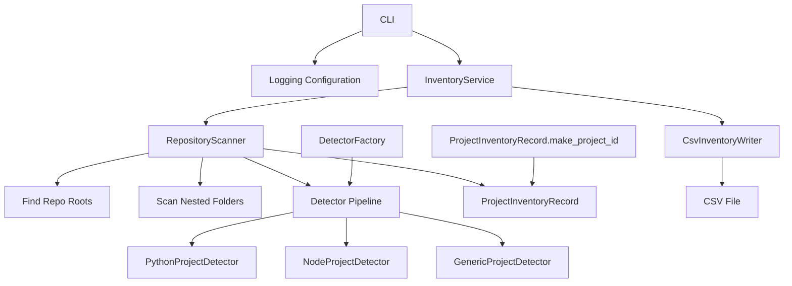

# Design

## Overview

The **Code Inventory Scanner** traverses a filesystem tree, identifies Git repositories, detects nested software projects inside those repositories, and exports the result as a CSV inventory.

It supports two common real-world cases:

1. **Standalone repositories** (the repo root is the project)
2. **Monorepos** containing multiple subprojects (nested Python/Node/etc. projects)

The scanner emits one CSV row per detected project, including both repo-root rows and nested-project rows when applicable.

---

## Recent design updates

This design reflects the current implementation baseline:

- Deterministic project IDs (stable across runs)
- Stronger path normalization and deduplication
- More defensive filesystem traversal and detector execution
- Centralized logging across CLI, service, scanner, detectors, and writer
- Dependency injection in the service layer for easier testing
- Improved CSV writer validation and output behavior
- Cleaner detector pipeline with explicit priority ordering

---

## Design goals

- Keep the inventory model small and useful
- Preserve repo-level and nested-project relationships
- Keep the CLI thin and repeatable
- Make project detection easy to extend
- Separate orchestration from scanning and file output
- Support reliable testing (unit and integration)
- Provide practical logging for troubleshooting

---

## Architecture

---

## Component responsibilities

### `cli.py`
- Parses CLI arguments (`--input`, `--output`, `--verbose`)
- Configures logging
- Resolves paths
- Invokes `InventoryService`
- Handles user-facing exit codes and error messages

The CLI intentionally does not contain business logic.

### `service.py` (`InventoryService`)
- Validates input/output paths
- Coordinates scanning and CSV writing
- Returns record count to the CLI
- Supports dependency injection (`scanner`, `writer`) for tests

This is the orchestration layer.

### `scanner.py` (`RepositoryScanner`)
- Traverses the filesystem
- Detects Git repository roots
- Detects nested projects inside repositories
- Deduplicates records by normalized path
- Extracts and normalizes GitHub remote URLs
- Builds `ProjectInventoryRecord` objects

This is the core domain logic.

### `detectors.py`
- Implements project classification rules
- Uses a detector pipeline (Python, Node, Generic)
- Returns a `DetectionResult` for matched folders

This is the classification subsystem.

### `models.py` (`ProjectInventoryRecord`)
- Defines the inventory record schema
- Normalizes string/keyword values
- Converts records to CSV rows
- Generates deterministic project IDs from normalized paths

This is the data model / DTO layer.

### `csv_writer.py` (`CsvInventoryWriter`)
- Validates output file path
- Ensures output directory exists
- Writes CSV headers and rows
- Logs row-level write progress (debug)

This is the persistence/output adapter.

---

## Software design patterns used

### Pattern summary in plain English

The short version, since design docs tend to drift into religion:

- **Strategy**: each detector is a replaceable classifier
- **Factory**: one place builds the detector pipeline
- **Service layer**: orchestration lives in one class, not the CLI
- **DTO**: record schema is a dataclass, not random dicts everywhere
- **Protocol + DI**: loose coupling so tests and future extensions are easier
- **Adapter-ish writer**: internal model is translated to CSV at the boundary

## 1) Strategy Pattern

### Where it appears
In `detectors.py`, each detector implements the same `detect(folder)` behavior:

- `PythonProjectDetector`
- `NodeProjectDetector`
- `GenericProjectDetector`

### Why this is Strategy
The scanner needs one behavior: “classify this folder if possible.”  
There are multiple algorithms for that classification depending on project type.

Instead of putting a giant `if/elif/elif` chain inside the scanner, detection is delegated to interchangeable strategies.

### Benefits in this app
- Easy to add new detectors (Swift, Java, Ruby, etc.)
- Detection logic stays isolated and testable
- Scanner stays focused on traversal, not classification details
- Detector order can express precedence (specific before generic)

### Practical example
The scanner calls each detector in order until one returns a `DetectionResult`. That is classic Strategy usage with ordered evaluation.

---

## 2) Factory Pattern

### Where it appears
`DetectorFactory.build()` creates the detector pipeline.

### Why this is Factory
The scanner should not know how to construct every detector or which order they should be in. Construction and ordering are centralized in one place.

### Benefits in this app
- One place to manage detector composition and priority
- Cleaner scanner initialization
- Easier future configuration (for example, user-selectable detectors)

### Practical example
If you add `SwiftProjectDetector`, you update the factory rather than changing scanner internals.

---

## 3) Service Layer Pattern

### Where it appears
`InventoryService` in `service.py`

### Why this is a Service Layer
The CLI should not handle validation, scanning, and writing directly. The service layer sits between the interface (CLI) and the domain/infrastructure components.

### What it coordinates
- Input/output validation
- Scanning (`RepositoryScanner`)
- CSV writing (`CsvInventoryWriter`)
- Logging of high-level workflow steps

### Benefits in this app
- Keeps CLI thin and stable
- Makes orchestration testable
- Allows alternate frontends later (GUI, API, batch runner) without duplicating logic

### Practical example
The same `InventoryService.run()` could be called from a future desktop UI without touching scanner or writer code.

---

## 4) Data Transfer Object (DTO) Pattern

### Where it appears
`ProjectInventoryRecord` dataclass in `models.py`

### Why this is a DTO
It carries structured project data between parts of the system:

- scanner builds it
- writer serializes it
- tests assert against it

It is intentionally simple and mostly data-focused.

### Benefits in this app
- Stable schema for records
- Less fragile dict-passing across modules
- Central place for normalization (`__post_init__`)
- Central CSV mapping (`to_csv_row()`)

### Practical example
Keywords are normalized once in the DTO rather than cleaned repeatedly in the scanner and writer.

---

## 5) Protocol-Based Interface (Structural Typing)

### Where it appears
`ProjectDetector` protocol in `detectors.py`

### Why it matters
This is not a classic Gang of Four “pattern” label, but it is an important design choice. The scanner depends on the **behavior** of a detector (`detect(...)`) rather than a concrete base class.

### Benefits in this app
- Loose coupling
- Easier test doubles/mocks
- Easier plugin-style extension later
- No inheritance hierarchy required

This is a clean Pythonic way to support Strategy.

---

## 6) Dependency Injection

### Where it appears
`InventoryService.__init__(scanner=None, writer=None)`

### Why it matters
Again, not always listed as a GoF pattern, but absolutely a design pattern in practice.

Instead of always instantiating concrete dependencies internally, the service can accept them from outside.

### Benefits in this app
- Easier unit testing with fakes/mocks
- Easier future swaps (JSON writer, alternate scanner)
- Less hidden coupling

### Practical example
A test can inject a fake scanner that returns fixed records and verify only writer behavior.

---

## 7) Adapter-Like Output Boundary

### Where it appears
`CsvInventoryWriter`

### Why this is adapter-like
The rest of the app works with `ProjectInventoryRecord` objects. The writer translates those records into a CSV representation.

That is effectively an adapter boundary from internal model objects to an external format.

### Benefits in this app
- CSV logic is isolated
- JSON/SQLite exporters can be added without changing scanner logic
- Output concerns stay out of the service and scanner

---

## Detection rules

## Repository root detection
A folder is treated as a repository root when it contains:

- `.git/` directory, or
- `.git` file (some worktree/submodule layouts)

The scanner emits a repo-root record for every repository found.

If the repo root also contains project markers (for example `pyproject.toml`), the repo-root row is classified using detector rules. Otherwise it is classified as a generic `Repository`.

---

## Nested project detection
Inside each repository, the scanner walks subfolders and applies detector strategies.

### Python markers
- `pyproject.toml`
- `setup.py`
- `requirements.txt`

### Node / JavaScript / TypeScript markers
- `package.json`
- `tsconfig.json` (TypeScript hint)

### Generic markers
- `Cargo.toml` (Rust)
- `go.mod` (Go)
- `*.csproj` (.NET / C#)
- `composer.json` (PHP)

For each nested project detected, the scanner records:

- project path
- repo root
- parent repo relationship
- detection source
- inferred language/project type
- normalized keywords

---

## Traversal and deduplication behavior

### Directory traversal
The scanner recursively traverses the input folder and skips common non-source directories such as:

- `.git`
- `.venv`
- `node_modules`
- `__pycache__`
- build/cache folders

This keeps scans cleaner and faster.

### Deduplication
Records are deduplicated by normalized filesystem path (`resolve()`), which avoids duplicate rows when a path is encountered more than once during traversal.

---

## Git remote URL extraction

For standard repos (where `.git` is a directory), the scanner reads `.git/config` and extracts the first available remote URL.

It normalizes common GitHub URL formats:

- `git@github.com:owner/repo.git` → `https://github.com/owner/repo`
- `https://github.com/owner/repo.git` → `https://github.com/owner/repo`

If no remote is available, `github_url` is left blank.

---

## Data model and CSV schema

## `ProjectInventoryRecord` fields (core)
- `project_id`
- `project_name`
- `project_type`
- `primary_language`
- `location`
- `github_url`
- `status`
- `keywords`
- `purpose`

## Supporting fields
- `repo_root`
- `is_repo_root`
- `parent_repo`
- `detection_source`

### Field behavior notes
- `project_id` is deterministic and derived from normalized path
- `keywords` are normalized (trimmed, deduplicated, sorted)
- `keywords` are exported to CSV as a semicolon-separated string
- `purpose` is currently blank by default (placeholder for future enrichment)

---

## Logging design

The application uses centralized logging configuration and module-level loggers.

### Logging goals
- INFO logs for high-level workflow progress
- DEBUG logs for detector matches, path normalization, and row-level writes
- Useful diagnostics without polluting business logic

### Why it matters
This tool operates on the filesystem, which means strange path and permission issues happen constantly. Logging is not decorative here.

---

## Testing strategy

## Unit tests
Unit tests focus on isolated behavior:
- detector classification
- scanner behavior on synthetic repo structures
- CSV writing and row formatting
- model normalization and ID generation

## Integration tests
Integration tests validate end-to-end CLI behavior:
- create temp folders/repos
- run CLI with `--input` and `--output`
- assert CSV output structure and key rows

This split keeps fast tests fast and still proves the full workflow works.

---

## Error handling approach

- CLI returns clear exit codes and writes errors to `stderr`
- Service validates input/output paths before work begins
- Scanner handles filesystem and detector-level `OSError` cases defensively
- Writer validates output path and logs progress/failures

The design favors predictable failure over silent partial output.

---

## Extension points

This design is intentionally easy to extend.

### Add a new detector
1. Implement `detect(folder)` returning `DetectionResult | None`
2. Add it to `DetectorFactory.build()` in the correct priority order
3. Add unit tests

### Add a new output format
1. Create a new writer (for example `JsonInventoryWriter`)
2. Reuse `ProjectInventoryRecord`
3. Inject the writer into `InventoryService`

### Add metadata enrichment
Examples:
- parse README first line into `purpose`
- inspect project files for dependencies
- infer project status from recent Git activity

---

## Future enhancements

- JSON output option (`--format json`) to preserve arrays natively
- `.inventoryignore` support
- Better git remote extraction for worktrees/submodules
- More detector types (Swift, Java, Ruby, etc.)
- Language inference by source file counts
- README parsing for `purpose`
- Incremental scans / caching for large trees
- Optional config file for detector settings and ignore rules
