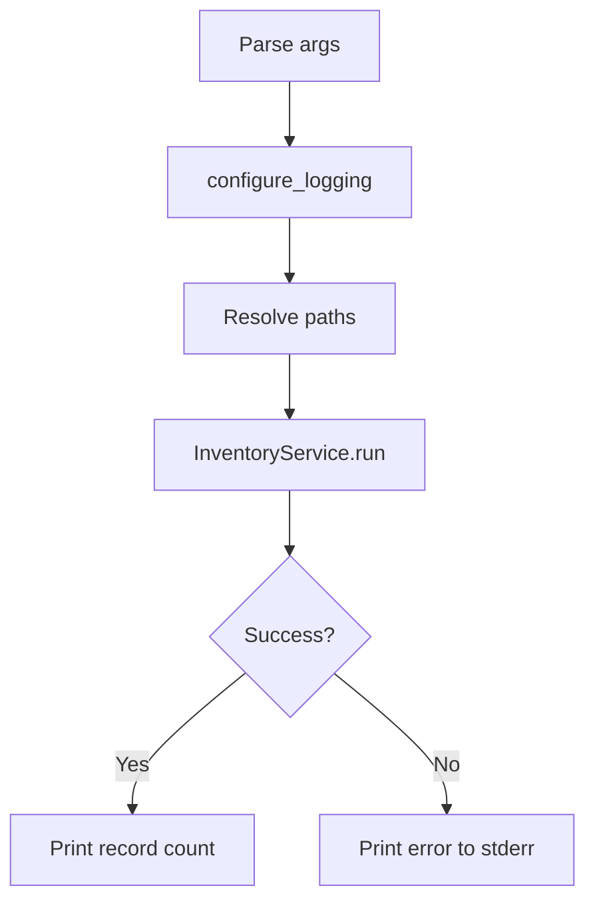

# CLI Module

Module: `code_inventory.cli`

The CLI module is the application entry point. It is intentionally thin and delegates all business logic to `InventoryService`.

## Responsibilities

- Parse CLI arguments
- Configure logging
- Resolve input/output paths
- Call the service layer
- Return process exit codes
- Print user-facing output/errors

## Public API

### `build_parser() -> argparse.ArgumentParser`

Builds and returns the argument parser.

#### Arguments supported

- `--input` (required): input folder to scan
- `--output` (required): output CSV path
- `--verbose` (optional): enable DEBUG logging

---

### `main(argv: Sequence[str] | None = None) -> int`

Runs the CLI workflow.

#### Behavior

1. Parse arguments
2. Configure logging
3. Resolve paths
4. Instantiate and run `InventoryService`
5. Return exit code

#### Exit codes

- `0` = success
- `1` = unexpected error
- `2` = input/output validation error

## Internal helpers

### `_resolve_paths(args: argparse.Namespace) -> tuple[Path, Path]`

Normalizes and resolves CLI path arguments.

## Error handling

The CLI catches:

- `FileNotFoundError`
- `NotADirectoryError`
- `PermissionError`

These are logged and printed to `stderr` with a non-zero exit code.

Unexpected errors are logged with stack traces and return exit code `1`.

## Design notes

The CLI does not:

- traverse the filesystem
- detect projects
- write CSV rows

That work belongs to `InventoryService` and downstream modules.

## Flow diagram

