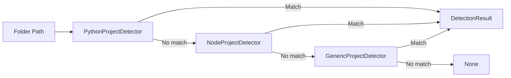

# Detectors Module

Module: `code_inventory.detectors`

This module implements the project classification subsystem.

## Key types

### `DetectionResult` (dataclass)

Represents a successful project detection match.

#### Fields

- `project_type: str`
- `primary_language: str`
- `keywords: list[str]`
- `detection_source: str`

This is a small DTO used by the scanner to build inventory records.

---

### `ProjectDetector` (Protocol)

Defines the detector interface:

- `detect(folder: Path) -> DetectionResult | None`

Any class implementing this method can participate in the detector pipeline.

This is Python structural typing, which keeps coupling low.

## Detectors

## `PythonProjectDetector`

Detects Python projects using marker files.

### Markers

- `pyproject.toml`
- `setup.py`
- `requirements.txt`

### Behavior

- Returns `None` if no markers found
- Adds keywords such as:
  - `python`
  - `pyproject`
  - `requirements`
  - `setuptools`
  - `src-layout` (if `src/` exists)

### Classification

- `CLI Tool` if `src/` directory exists
- `Script` otherwise

---

## `NodeProjectDetector`

Detects Node.js / JavaScript / TypeScript projects.

### Markers

- `package.json` (required)
- `tsconfig.json` (optional TypeScript signal)

### Classification

- `project_type = "Web App"` (current default)
- `primary_language = "TypeScript"` if `tsconfig.json` exists
- otherwise `primary_language = "JavaScript"`

### Keywords

- `node`
- `javascript`
- `typescript` (optional)

---

## `GenericProjectDetector`

Detects common project types using a marker map.

### Current markers

- `Cargo.toml` → Rust
- `go.mod` → Go
- `*.csproj` → C#
- `composer.json` → PHP

### Behavior

Supports both:

- exact filename markers
- suffix-based markers (e.g. `.csproj`)

## Factory

### `DetectorFactory.build() -> list[ProjectDetector]`

Constructs the detector pipeline in priority order.

Current order:

1. `PythonProjectDetector`
2. `NodeProjectDetector`
3. `GenericProjectDetector`

This ordering is important because the scanner stops at the first match.

## Detector pipeline diagram

## Design notes

This module implements the **Strategy Pattern**:

- each detector is a strategy
- the scanner applies them in order
- `DetectorFactory` centralizes construction and ordering

## Extension example

To add a Swift detector:

1. Create `SwiftProjectDetector.detect(folder)`
2. Return `DetectionResult | None`
3. Add it to `DetectorFactory.build()` before `GenericProjectDetector`
4. Add tests