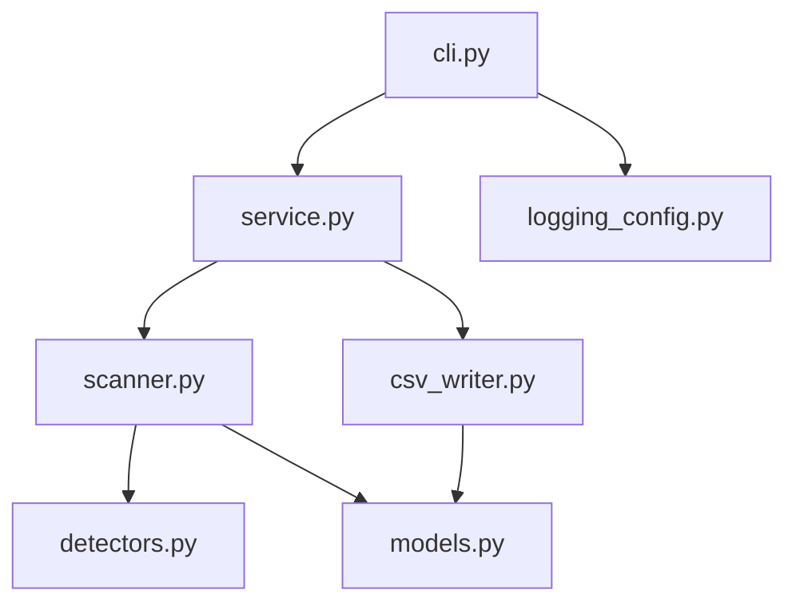
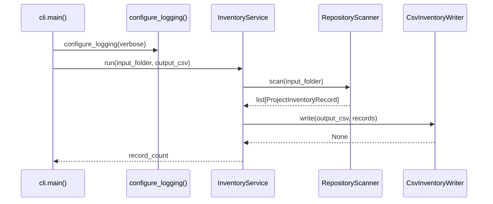

# API Reference

This section documents the Python modules that make up the **Code Inventory Scanner**.

The codebase is organized into small modules with clear responsibilities:

- **CLI** for argument parsing and process exit behavior
- **Service** for orchestration
- **Scanner** for filesystem traversal and project detection
- **Detectors** for classification strategies
- **Models** for record structure and CSV conversion
- **CSV Writer** for output serialization
- **Logging Config** for centralized logging setup

## Module map

## Typical runtime flow

## Notes

- Paths are normalized before scanning and record creation.
- Project IDs are deterministic and derived from normalized paths.
- CSV output flattens `keywords` into a semicolon-separated string.
- Logging is centralized and supports `--verbose` (DEBUG mode).