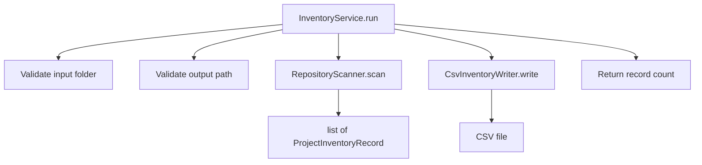

# Service Module

Module: `code_inventory.service`

The service module contains the orchestration layer for the application.

## Class: `InventoryService`

Coordinates repository scanning and CSV export.

## Responsibilities

- Validate input folder
- Validate output path
- Invoke `RepositoryScanner`
- Invoke `CsvInventoryWriter`
- Return the record count

## Constructor

### `InventoryService(scanner: RepositoryScanner | None = None, writer: CsvInventoryWriter | None = None)`

Supports dependency injection for testing and extension.

#### Dependency injection
You can inject:

- a custom scanner
- a custom writer

This makes unit tests easier and supports future output formats.

## Public methods

### `run(input_folder: Path, output_csv: Path) -> int`

Executes the full inventory workflow.

#### Parameters

- `input_folder`: folder to scan
- `output_csv`: output CSV file path

#### Returns

- number of records written

#### Raises

- `FileNotFoundError`
- `NotADirectoryError`
- `PermissionError`
- `OSError`

## Internal helpers

### `_validate_input_folder(input_folder: Path) -> None`

Validates:

- path exists
- path is a directory
- directory is readable

---

### `_validate_output_path(output_csv: Path) -> None`

Validates output parent directory if it already exists:

- parent is a directory
- parent is writable

Directory creation is handled by the writer.

---

### `_is_readable_dir(path: Path) -> bool`

Checks if a directory can be read.

---

### `_is_writable_dir(path: Path) -> bool`

Checks if a directory can be written to by creating/removing a temporary file.

## Service orchestration diagram

## Design notes

This module implements the **Service Layer** pattern:

- CLI remains thin
- scanner and writer remain focused
- orchestration is centralized and testable