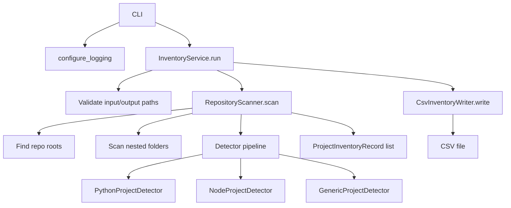
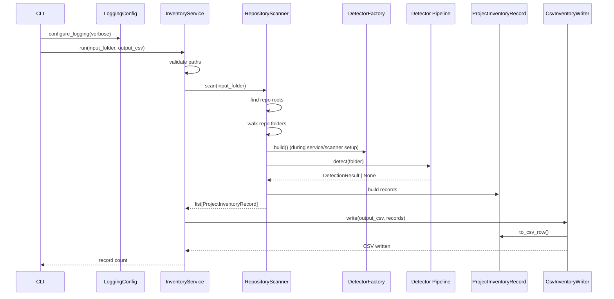

# Architecture

This page describes the runtime architecture of the **Code Inventory Scanner** and how the main modules interact during a scan.

## High-level flow

## Module responsibilities

### `code_inventory.cli`
The CLI is intentionally thin.

It is responsible for:

- Parsing arguments (`--input`, `--output`, `--verbose`)
- Configuring logging
- Resolving paths
- Calling `InventoryService`
- Returning exit codes and printing user-facing messages

It does **not** contain scanning or CSV logic.

---

### `code_inventory.logging_config`
Centralized logging setup for the application.

It provides:

- Root logger configuration
- INFO/DEBUG level selection (`--verbose`)
- Consistent log formatting
- Handler reset behavior to avoid duplicate logs in repeated runs/tests

---

### `code_inventory.service`
`InventoryService` is the orchestration layer.

It is responsible for:

- Validating the input folder
- Validating the output path
- Running the scanner
- Passing records to the CSV writer
- Returning the number of rows written

The service supports dependency injection (`scanner`, `writer`) for easier testing.

---

### `code_inventory.scanner`
`RepositoryScanner` contains the core traversal and inventory logic.

It is responsible for:

- Walking the filesystem
- Detecting Git repository roots
- Scanning repositories for nested projects
- Running detector strategies
- Extracting and normalizing GitHub remote URLs
- Deduplicating records by normalized path
- Building `ProjectInventoryRecord` objects

This is the main domain workflow component.

---

### `code_inventory.detectors`
This module contains the project classification strategies.

Current detectors:

- `PythonProjectDetector`
- `NodeProjectDetector`
- `GenericProjectDetector`

Each detector examines a folder and either:

- returns a `DetectionResult`, or
- returns `None` if it does not match

The detectors are built in priority order by `DetectorFactory`.

---

### `code_inventory.models`
This module defines the record model used across the application.

`ProjectInventoryRecord` is responsible for:

- carrying inventory data
- normalizing string fields
- normalizing keywords (trim, dedupe, sort)
- generating deterministic project IDs
- converting the record into a CSV row dictionary

---

### `code_inventory.csv_writer`
`CsvInventoryWriter` is the output boundary for CSV.

It is responsible for:

- validating the output file path
- ensuring the output directory exists
- writing headers and rows
- logging write progress

It converts `ProjectInventoryRecord` objects into CSV rows using `record.to_csv_row()`.

---

## Runtime sequence

The following sequence shows the normal execution path.

## Detection architecture

## Detector pipeline
The scanner uses an ordered detector pipeline.

Order matters:

1. `PythonProjectDetector`
2. `NodeProjectDetector`
3. `GenericProjectDetector`

This prevents generic markers from overriding a more specific classification.

For example, a folder with Python markers should be classified as Python before any generic fallback is considered.

---

## Detection results
Detectors return a `DetectionResult` containing:

- `project_type`
- `primary_language`
- `keywords`
- `detection_source`

This keeps the scanner independent from the details of any one detector.

---

## Filesystem traversal behavior

## Repository roots
A folder is treated as a repository root if it contains:

- `.git/` directory, or
- `.git` file

The scanner emits a repo-root row for every repository.

If the repo root also contains project markers, the repo-root row is classified using the detector pipeline. Otherwise it is recorded as a generic `Repository`.

---

## Nested projects
Within each repository, the scanner traverses subfolders and runs the detector pipeline.

Supported marker examples include:

- Python: `pyproject.toml`, `setup.py`, `requirements.txt`
- Node: `package.json`, `tsconfig.json`
- Generic: `Cargo.toml`, `go.mod`, `*.csproj`, `composer.json`

Each nested match becomes a separate inventory row linked back to its repo root.

---

## Ignored directories
Traversal skips common non-source and generated directories, including:

- `.git`
- `.venv`, `venv`
- `node_modules`
- `__pycache__`
- `.pytest_cache`, `.mypy_cache`, `.ruff_cache`
- `.idea`, `.vscode`
- `build`, `dist`

This keeps scans focused and avoids unnecessary noise.

---

## Data flow and record model

## `ProjectInventoryRecord`
The scanner builds one `ProjectInventoryRecord` per detected project.

The record contains:

### Core fields
- `project_id`
- `project_name`
- `project_type`
- `primary_language`
- `location`
- `github_url`
- `status`
- `keywords`
- `purpose`

### Relationship and metadata fields
- `repo_root`
- `is_repo_root`
- `parent_repo`
- `detection_source`

---

## ID generation
`project_id` is generated deterministically from the normalized filesystem path, so IDs remain stable across runs for the same path.

This avoids the instability of Python’s built-in `hash()` across interpreter sessions.

---

## CSV output boundary

The CSV writer is deliberately separated from scanning logic.

Why this matters:

- Scanner code stays focused on discovery/classification
- CSV serialization rules live in one place
- Alternate outputs (JSON, SQLite, etc.) can be added later without changing the scanner

`keywords` are exported as a semicolon-separated string in CSV while remaining a normalized list internally.

---

## Logging architecture

Logging is used across all modules with module-level loggers.

### Logging levels
- **INFO**: high-level progress (start scan, records found, CSV written)
- **DEBUG**: detector matches, path normalization, row writes, traversal details

### CLI behavior
- Default: INFO logging
- `--verbose`: DEBUG logging

This is especially useful for filesystem debugging, which is where software goes to become folklore.

---

## Design patterns in the architecture

This implementation uses a small set of practical design patterns:

- **Strategy**: detector classes are interchangeable folder-classification strategies
- **Factory**: `DetectorFactory` constructs the detector pipeline in priority order
- **Service Layer**: `InventoryService` coordinates validation, scanning, and writing
- **DTO**: `ProjectInventoryRecord` carries structured inventory data
- **Dependency Injection**: `InventoryService` accepts injected scanner/writer dependencies
- **Adapter-like Output Boundary**: `CsvInventoryWriter` translates records into CSV format

For the full design rationale, see the project-level `DESIGN.md`.

---

## Extension points

### Add a detector
1. Implement `detect(folder) -> DetectionResult | None`
2. Add it to `DetectorFactory.build()` in the right order
3. Add unit tests

### Add an output format
1. Create a new writer (for example, JSON)
2. Reuse `ProjectInventoryRecord`
3. Inject the writer into `InventoryService`

### Add enrichment
Examples:

- parse README first line into `purpose`
- infer language by file counts
- enrich status from Git activity

The architecture keeps these concerns separate so they can be added without rewriting the scanner.